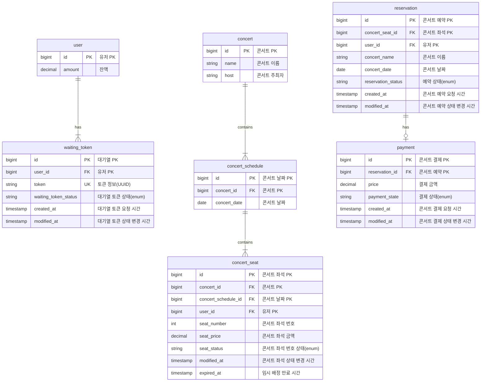
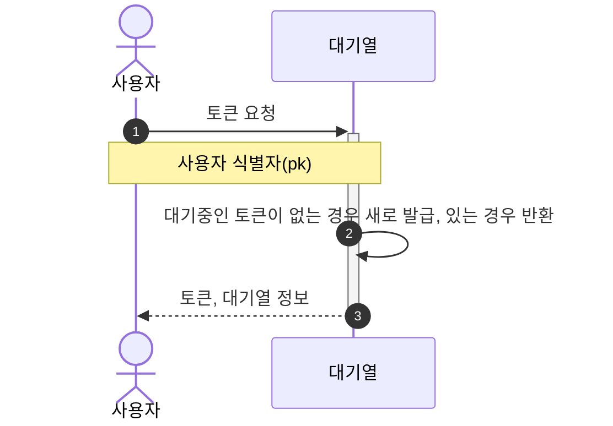
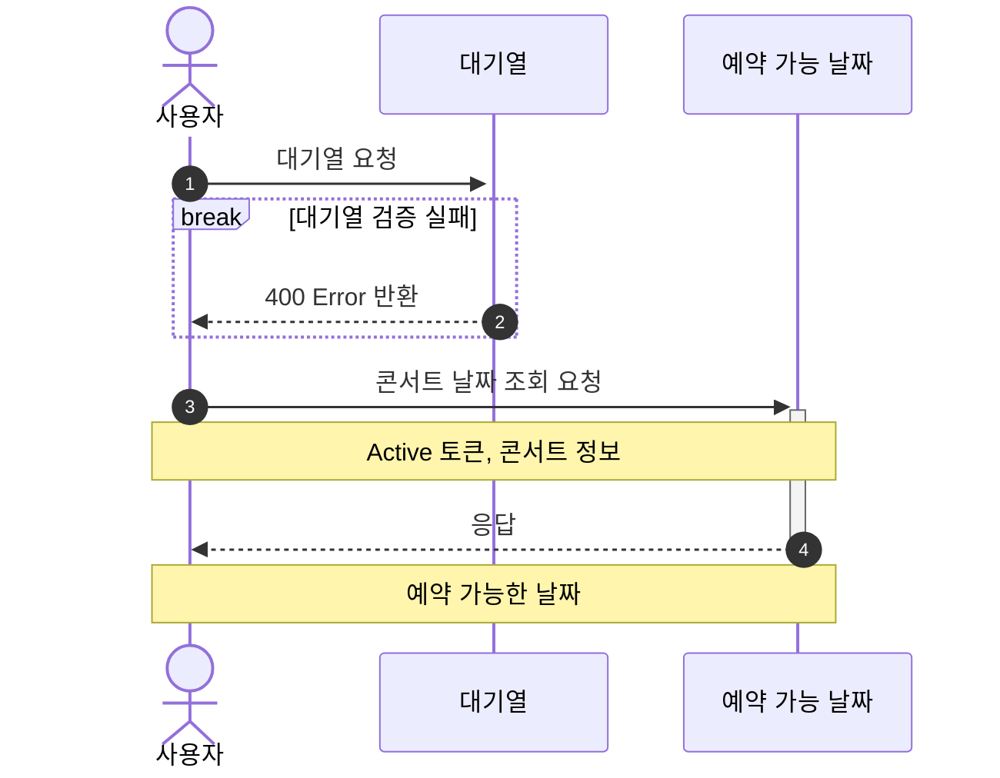
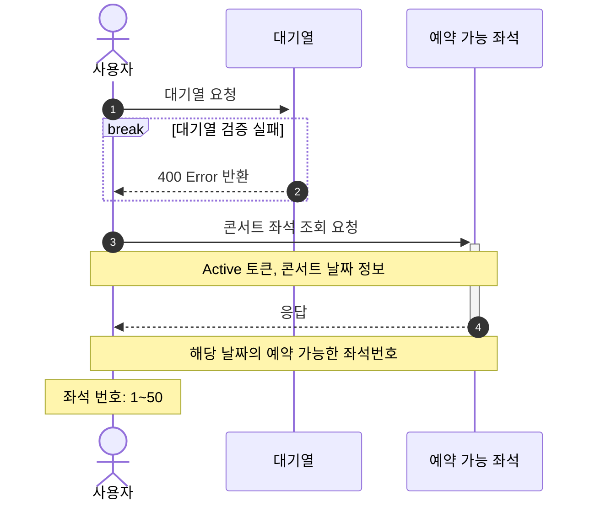
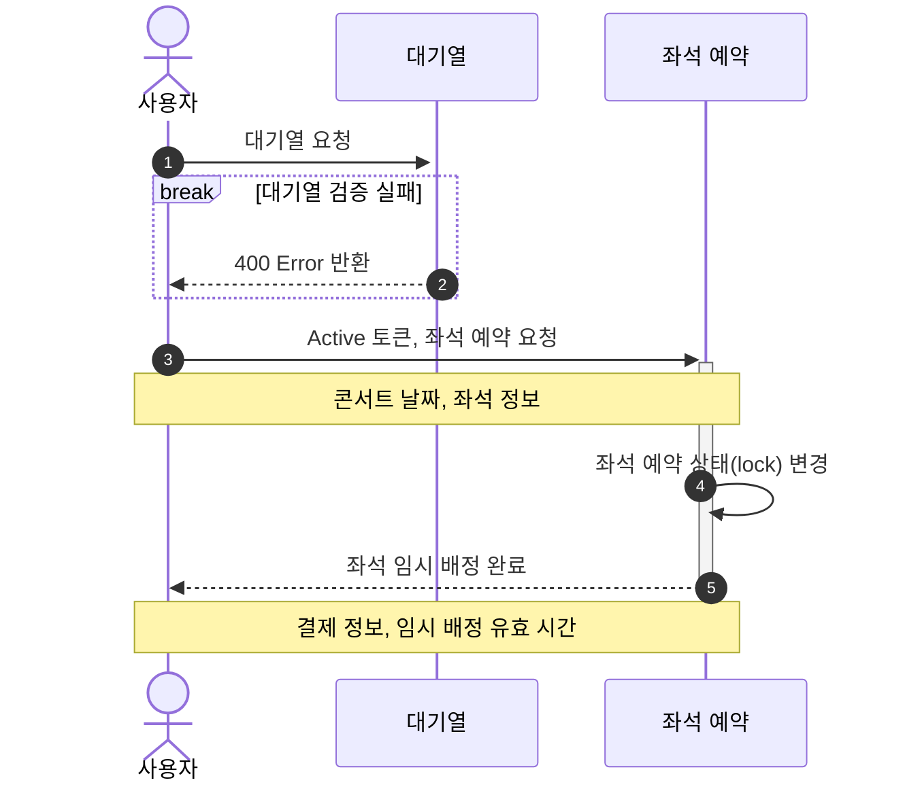
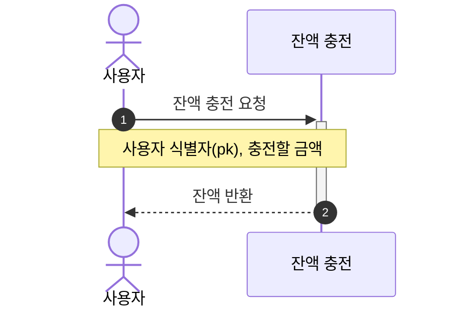
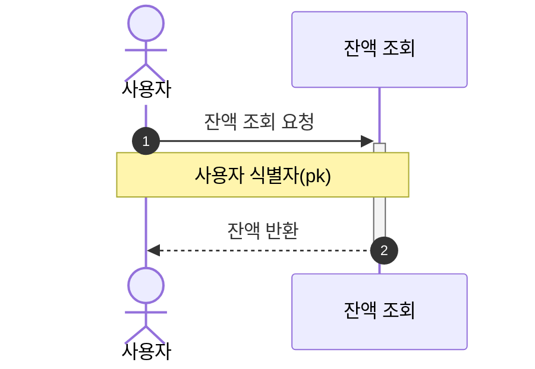
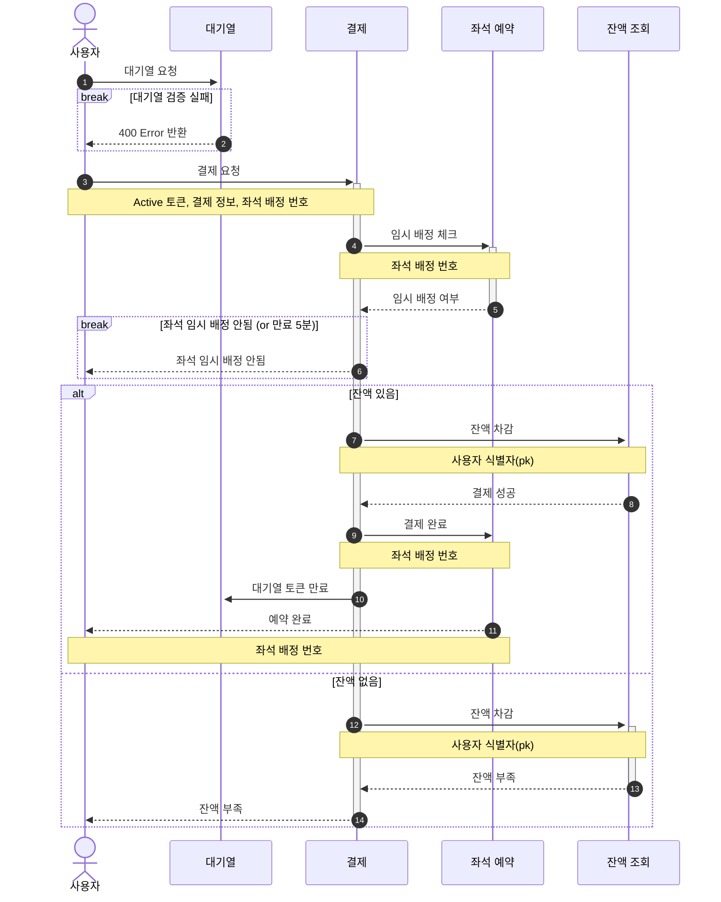

# 🎸 콘서트 예약 서비스

## 📄 Documents
- [비즈니스 로직 중 발생 가능한 동시성 이슈 파악](https://github.com/kdelay/Concert-Booking/wiki/%EB%B9%84%EC%A6%88%EB%8B%88%EC%8A%A4-%EB%A1%9C%EC%A7%81-%EC%A4%91-%EB%B0%9C%EC%83%9D-%EA%B0%80%EB%8A%A5%ED%95%9C-%EB%8F%99%EC%8B%9C%EC%84%B1-%EC%9D%B4%EC%8A%88-%ED%8C%8C%EC%95%85)
- [대기열 Redis 이관 및 Cache Service 도입](https://cojyeon.tistory.com/320)
- [부하를 적절하게 축소하기 위한 방안 고려](https://github.com/kdelay/Concert-Booking/wiki/%EB%B6%80%ED%95%98%EB%A5%BC-%EC%A0%81%EC%A0%88%ED%95%98%EA%B2%8C-%EC%B6%95%EC%86%8C%ED%95%98%EA%B8%B0-%EC%9C%84%ED%95%9C-%EB%B0%A9%EC%95%88-%EA%B3%A0%EB%A0%A4)
- [MSA 서비스 분리 확장 설계](https://github.com/kdelay/Concert-Booking/wiki/MSA-%EC%84%9C%EB%B9%84%EC%8A%A4-%EB%B6%84%EB%A6%AC-%ED%99%95%EC%9E%A5-%EC%84%A4%EA%B3%84)
- [부하 테스트](https://github.com/kdelay/Concert-Booking/wiki/%EB%B6%80%ED%95%98-%ED%85%8C%EC%8A%A4%ED%8A%B8)

## ✏️ Description
- 대기열 시스템을 통해 유입 트래픽을 관리할 수 있다.
- 예약 서비스는 토큰이 있는 유저만 수행할 수 있다.
- 좌석 예약 요청 시, 결제가 이루어지지 않더라도 일정 시간동안 다른 유저가 해당 좌석에 접근할 수 없도록 한다.
- 결제 시, 사용자는 미리 충전한 잔액을 이용한다.

## 📝 API
- 대기열 토큰 등록 및 조회 API
- 콘서트 목록 조회 API
- 콘서트 일정 목록 조회 API
- 콘서트 좌석 목록 조회 API
- 콘서트 예약 요청 API
- 콘서트 좌석 결제 API

### 🔑 API Specs
1️⃣ **유저 대기열 토큰 기능**
- 서비스를 이용할 토큰을 발급받는 API 를 작성한다.
- 토큰은 유저의 UUID 와 해당 유저의 대기열을 관리할 수 있는 정보 ( 대기 순서 or 잔여 시간 등 ) 를 포함한다.
- 이후 모든 API 는 위 토큰을 이용해 대기열 검증을 통과해야 이용 가능하다.

> 기본적으로 폴링으로 본인의 대기열을 확인한다고 가정한다.

2️⃣ **콘서트 날짜 / 좌석 API**
- 콘서트 날짜와 해당 날짜의 좌석을 조회하는 API 를 각각 작성한다.
- 콘서트 날짜 목록을 조회할 수 있다.
- 날짜 정보를 입력받아 예약 가능한 좌석 정보를 조회할 수 있다.

> 좌석 정보는 1 ~ 50 까지의 좌석 번호로 관리된다.

3️⃣ **콘서트 좌석 예약 요청 API**
- 날짜와 좌석 정보를 입력 받아 좌석을 예약 처리하는 API 를 작성한다.
- 좌석 예약과 동시에 해당 좌석은 그 유저에게 약 5분간 임시 배정된다.
- 만약 배정 시간 내에 결제가 완료되지 않는다면, 좌석에 대한 임시 배정은 해제되어야 하며 다른 사용자는 예약할 수 있어야 한다.

4️⃣ **유저 잔액 충전 / 조회 API**
- 결제에 사용될 금액을 API 를 통해 충전하는 API 를 작성한다.
- 사용자 식별자 및 충전할 금액을 받아 잔액을 충전한다.
- 사용자 식별자를 통해 해당 사용자의 잔액을 조회한다.

5️⃣ **결제 API**
- 결제 처리하고 결제 내역을 생성하는 API 를 작성한다.
- 결제가 완료되면 해당 좌석의 소유권을 유저에게 배정하고 대기열 토큰을 만료시킨다.

💡 **KEY POINT**
- 유저 간 대기열 요청을 순서대로 정확하게 어떻게 제공할 것인가?
- 동시에 여러 사용자가 예약 요청을 했을 때, 좌석이 중복으로 배정 가능하지 않도록 해야 한다.

---

## 📆 Milestone
https://github.com/users/kdelay/projects/7/views/4

## 📊 ERD Diagram


## 👤 Sequence Diagram
### 토큰 발급 API

### 예약 가능 날짜 조회 API


### 좌석 조회 API


### 좌석 예약 요청 API


### 잔액 충전 API


### 잔액 조회 API


### 결제 API


---

# 🌲 Tree
```text
├── api
│   ├── concert
│   │   ├── application
│   │   │   └── DataPlatformSendService.java
│   │   ├── domain
│   │   │   ├── Concert.java
│   │   │   ├── ConcertRepository.java
│   │   │   ├── ConcertSchedule.java
│   │   │   ├── ConcertSeat.java
│   │   │   ├── ConcertService.java
│   │   │   ├── MockApiClient.java
│   │   │   ├── Payment.java
│   │   │   ├── PaymentOutbox.java
│   │   │   ├── Reservation.java
│   │   │   ├── enums
│   │   │   │   ├── ConcertSeatStatus.java
│   │   │   │   ├── PaymentOutboxState.java
│   │   │   │   ├── PaymentState.java
│   │   │   │   └── ReservationStatus.java
│   │   │   ├── event
│   │   │   │   ├── PaymentEventPublisher.java
│   │   │   │   └── PaymentSuccessEvent.java
│   │   │   └── message
│   │   │       ├── PaymentMessageOutboxManager.java
│   │   │       └── PaymentMessageSender.java
│   │   ├── infrastructure
│   │   │   ├── ConcertMapper.java
│   │   │   ├── MockApiClientImpl.java
│   │   │   ├── db
│   │   │   │   ├── ConcertEntity.java
│   │   │   │   ├── ConcertScheduleEntity.java
│   │   │   │   ├── ConcertSeatEntity.java
│   │   │   │   ├── PaymentEntity.java
│   │   │   │   ├── PaymentOutboxEntity.java
│   │   │   │   ├── ReservationEntity.java
│   │   │   │   └── repository
│   │   │   │       ├── ConcertRepositoryImpl.java
│   │   │   │       ├── JpaConcertRepository.java
│   │   │   │       ├── JpaConcertScheduleRepository.java
│   │   │   │       ├── JpaConcertSeatRepository.java
│   │   │   │       ├── JpaPaymentOutboxRepository.java
│   │   │   │       ├── JpaPaymentRepository.java
│   │   │   │       ├── JpaReservationRepository.java
│   │   │   │       └── PaymentMessageOutboxManagerImpl.java
│   │   │   ├── kafka
│   │   │   │   └── PaymentKafkaMessageSender.java
│   │   │   └── spring
│   │   │       └── PaymentSpringEventPublisher.java
│   │   └── interfaces
│   │       ├── ConcertController.java
│   │       ├── consumer
│   │       │   └── PaymentMessageConsumer.java
│   │       ├── event
│   │       │   └── PaymentEventListener.java
│   │       ├── request
│   │       │   ├── BookingSeatsRequest.java
│   │       │   └── PayRequest.java
│   │       └── response
│   │           ├── BookingSeatsResponse.java
│   │           ├── PayResponse.java
│   │           ├── SearchPaymentResponse.java
│   │           ├── SearchScheduleResponse.java
│   │           └── SearchSeatsResponse.java
│   ├── user
│   │   ├── domain
│   │   │   ├── User.java
│   │   │   ├── UserRepository.java
│   │   │   └── UserService.java
│   │   ├── infrastructure
│   │   │   ├── JpaUserRepository.java
│   │   │   ├── UserEntity.java
│   │   │   └── UserRepositoryImpl.java
│   │   └── interfaces
│   │       ├── ChargeRequest.java
│   │       ├── ChargeResponse.java
│   │       ├── SearchAmountResponse.java
│   │       └── UserController.java
│   └── waiting
│       ├── domain
│       │   ├── WaitingService.java
│       │   ├── WaitingToken.java
│       │   ├── WaitingTokenRepository.java
│       │   └── enums
│       │       └── WaitingTokenStatus.java
│       ├── infrastructure
│       │   ├── RedisLockRepository.java
│       │   └── WaitingTokenRepositoryImpl.java
│       └── interfaces
│           ├── TokenResponse.java
│           ├── WaitingController.java
│           └── event
└── support
    ├── JsonUtil.java
    ├── LoggingFilter.java
    ├── WaitingInterceptor.java
    ├── config
    │   ├── AsyncConfig.java
    │   ├── FilterConfig.java
    │   ├── KafkaConfig.java
    │   ├── RedisCacheConfig.java
    │   ├── RedisConfig.java
    │   └── WebMvcConfig.java
    ├── exception
    │   ├── BaseException.java
    │   ├── CustomBadRequestException.java
    │   ├── CustomNotFoundException.java
    │   ├── ErrorCode.java
    │   └── Exception.java
    ├── handler
    │   ├── ApiControllerAdvice.java
    │   ├── ApiResultResponse.java
    │   ├── ErrorResponse.java
    │   ├── LockHandler.java
    │   └── TransactionHandler.java
    └── scheduler
        ├── ConcertSeatScheduler.java
        ├── KafkaRepublishScheduler.java
        └── WaitingTokenScheduler.java
```
