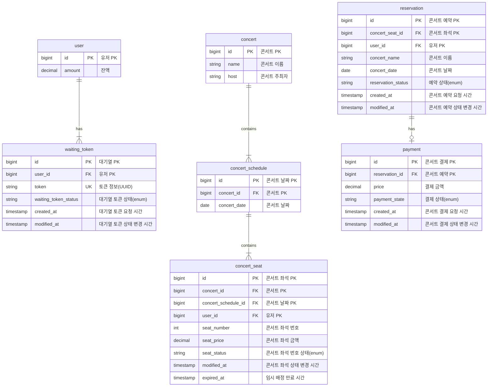
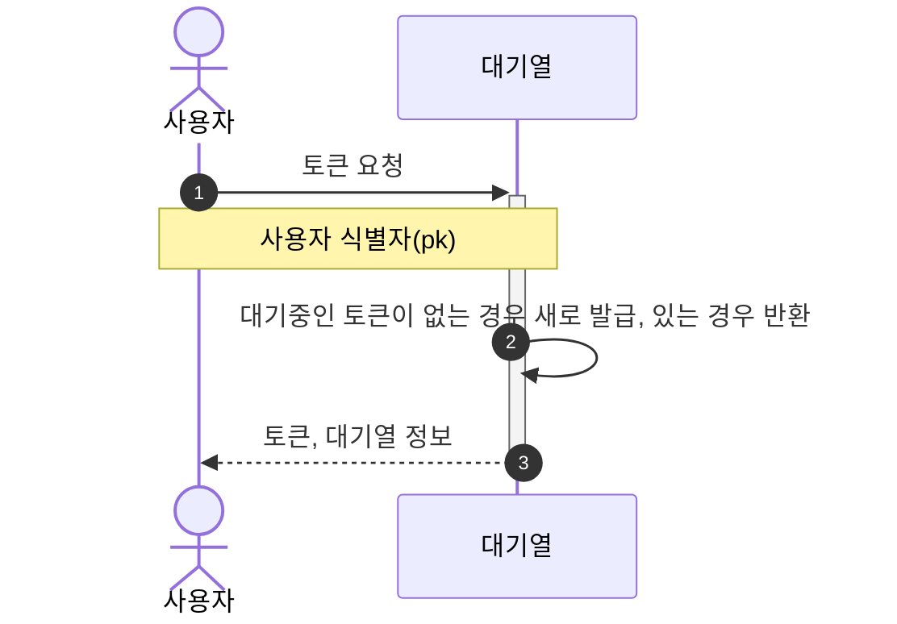
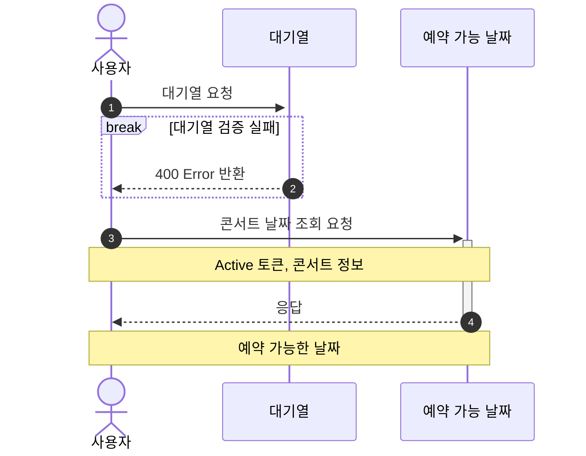
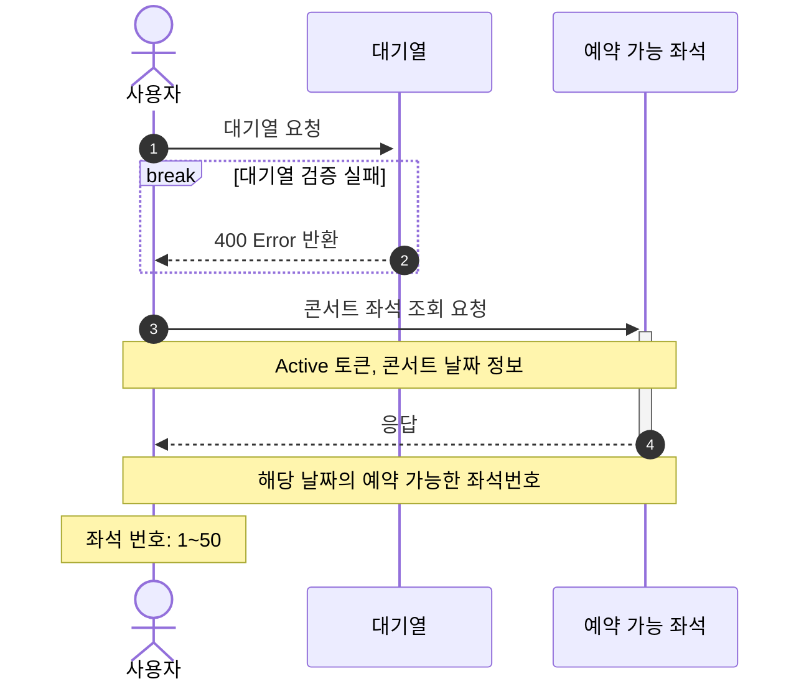
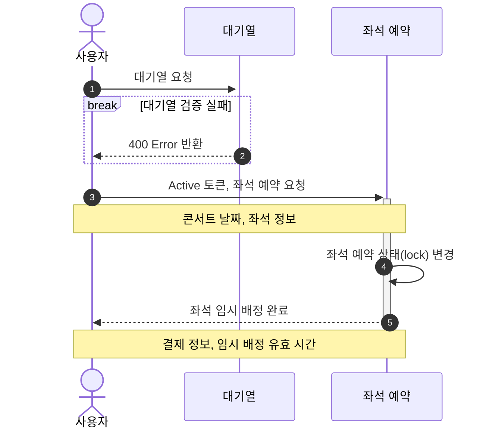
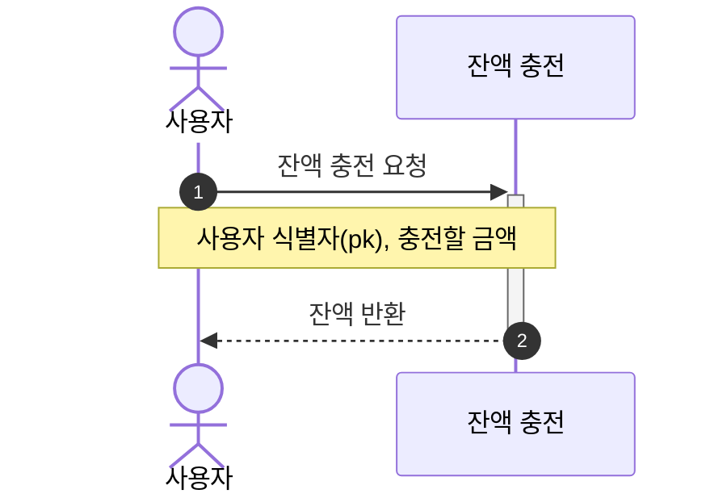
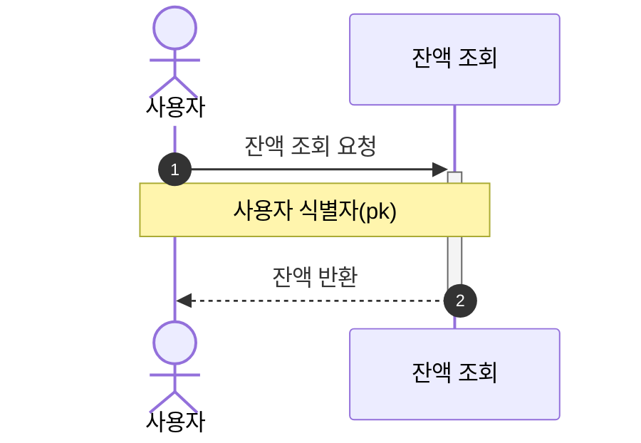
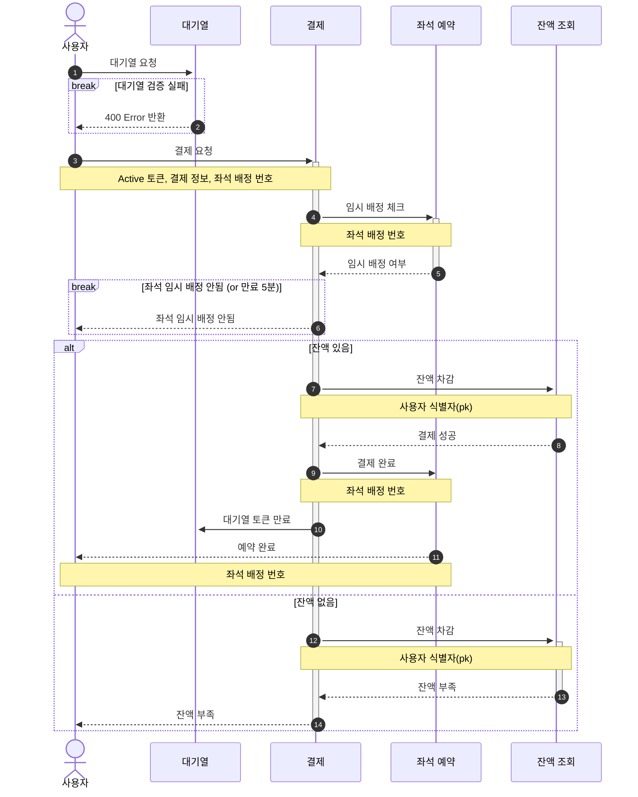

# Concert-Reservation
```
🎸 콘서트 예약 서비스
```

## ✏️ Description
- `콘서트 예약 서비스`를 구현해 봅니다.
- 대기열 시스템을 구축하고, 예약 서비스는 작업가능한 유저만 수행할 수 있도록 해야합니다.
- 사용자는 좌석예약 시에 미리 충전한 잔액을 이용합니다.
- 좌석 예약 요청시에, 결제가 이루어지지 않더라도 일정 시간동안 다른 유저가 해당 좌석에 접근할 수 없도록 합니다.

## 📝 Requirements
- 아래 5가지 API 를 구현합니다.
    - 유저 토큰 발급 API
    - 예약 가능 날짜 / 좌석 API
    - 좌석 예약 요청 API
    - 잔액 충전 / 조회 API
    - 결제 API
- 각 기능 및 제약사항에 대해 단위 테스트를 반드시 하나 이상 작성하도록 합니다.
- 다수의 인스턴스로 어플리케이션이 동작하더라도 기능에 문제가 없도록 작성하도록 합니다.
- 동시성 이슈를 고려하여 구현합니다.
- 대기열 개념을 고려해 구현합니다.

## 🔑 API Specs
1️⃣ **`주요` 유저 대기열 토큰 기능**
- 서비스를 이용할 토큰을 발급받는 API를 작성합니다.
- 토큰은 유저의 UUID 와 해당 유저의 대기열을 관리할 수 있는 정보 ( 대기 순서 or 잔여 시간 등 ) 를 포함합니다.
- 이후 모든 API 는 위 토큰을 이용해 대기열 검증을 통과해야 이용 가능합니다.

> 기본적으로 폴링으로 본인의 대기열을 확인한다고 가정하며, 다른 방안 또한 고려해보고 구현해 볼 수 있습니다.

**2️⃣ `기본` 예약 가능 날짜 / 좌석 API**
- 예약가능한 날짜와 해당 날짜의 좌석을 조회하는 API 를 각각 작성합니다.
- 예약 가능한 날짜 목록을 조회할 수 있습니다.
- 날짜 정보를 입력받아 예약가능한 좌석정보를 조회할 수 있습니다.

> 좌석 정보는 1 ~ 50 까지의 좌석번호로 관리됩니다.

3️⃣ **`주요` 좌석 예약 요청 API**
- 날짜와 좌석 정보를 입력받아 좌석을 예약 처리하는 API 를 작성합니다.
- 좌석 예약과 동시에 해당 좌석은 그 유저에게 약 5분간 임시 배정됩니다. ( 시간은 정책에 따라 자율적으로 정의합니다. )
- 만약 배정 시간 내에 결제가 완료되지 않는다면 좌석에 대한 임시 배정은 해제되어야 하며 다른 사용자는 예약할 수 없어야 한다.

4️⃣ **`기본`**  **잔액 충전 / 조회 API**
- 결제에 사용될 금액을 API 를 통해 충전하는 API 를 작성합니다.
- 사용자 식별자 및 충전할 금액을 받아 잔액을 충전합니다.
- 사용자 식별자를 통해 해당 사용자의 잔액을 조회합니다.

5️⃣ **`주요` 결제 API**
- 결제 처리하고 결제 내역을 생성하는 API 를 작성합니다.
- 결제가 완료되면 해당 좌석의 소유권을 유저에게 배정하고 대기열 토큰을 만료시킵니다.

💡 **KEY POINT**
- 유저간 대기열을 요청 순서대로 정확하게 제공할 방법을 고민해 봅니다.
- 동시에 여러 사용자가 예약 요청을 했을 때, 좌석이 중복으로 배정 가능하지 않도록 합니다.

### 💠 API 명세
- `Endpoint` - API 의 URL 및 기능을 설명할 수 있는 적절한 HTTP Method
- `Request` - Param, Query, Body 등 API 호출 시 전달되어야 할 매개변수 및 데이터
- `Response` - API 의 응답 코드, 데이터 등에 대한 명세 및 적절한 예제
- `Error` - API 호출 중 발생할 수 있는 예외 케이스에 대해 명시
- `Authorization` - 필요한 인증, 권한에 대해서도 명시


## 📆 Milestone


## 📊 ERD Diagram


## 👤 Sequence Diagram
### 토큰 발급 API

### 예약 가능 날짜 조회 API


### 좌석 조회 API


### 좌석 예약 요청 API


### 잔액 충전 API


### 잔액 조회 API


### 결제 API


# Tree
```text
└── src
    ├── main
    │   ├── java
    │   │   └── booking
    │   │       ├── BookingApplication.java
    │   │       ├── api
    │   │       │   ├── concert
    │   │       │   │   ├── Payment.java
    │   │       │   │   ├── domain
    │   │       │   │   │   ├── Concert.java
    │   │       │   │   │   ├── ConcertRepository.java
    │   │       │   │   │   ├── ConcertSchedule.java
    │   │       │   │   │   ├── ConcertSeat.java
    │   │       │   │   │   ├── ConcertService.java
    │   │       │   │   │   ├── Reservation.java
    │   │       │   │   │   └── enums
    │   │       │   │   │       ├── ConcertSeatStatus.java
    │   │       │   │   │       ├── PaymentState.java
    │   │       │   │   │       └── ReservationStatus.java
    │   │       │   │   ├── infrastructure
    │   │       │   │   │   ├── ConcertEntity.java
    │   │       │   │   │   ├── ConcertMapper.java
    │   │       │   │   │   ├── ConcertRepositoryImpl.java
    │   │       │   │   │   ├── ConcertScheduleEntity.java
    │   │       │   │   │   ├── ConcertSeatEntity.java
    │   │       │   │   │   ├── JpaConcertRepository.java
    │   │       │   │   │   ├── JpaConcertScheduleRepository.java
    │   │       │   │   │   ├── JpaConcertSeatRepository.java
    │   │       │   │   │   ├── JpaPaymentRepository.java
    │   │       │   │   │   ├── JpaReservationRepository.java
    │   │       │   │   │   ├── PaymentEntity.java
    │   │       │   │   │   └── ReservationEntity.java
    │   │       │   │   └── presentation
    │   │       │   │       ├── ConcertController.java
    │   │       │   │       ├── PaymentController.java
    │   │       │   │       ├── request
    │   │       │   │       │   ├── BookingSeatsRequest.java
    │   │       │   │       │   └── PayRequest.java
    │   │       │   │       └── response
    │   │       │   │           ├── BookingSeatsResponse.java
    │   │       │   │           ├── PayResponse.java
    │   │       │   │           ├── SearchPaymentResponse.java
    │   │       │   │           ├── SearchScheduleResponse.java
    │   │       │   │           └── SearchSeatsResponse.java
    │   │       │   └── waiting
    │   │       │       ├── domain
    │   │       │       │   ├── User.java
    │   │       │       │   ├── UserService.java
    │   │       │       │   ├── WaitingToken.java
    │   │       │       │   ├── WaitingTokenRepository.java
    │   │       │       │   ├── WaitingTokenService.java
    │   │       │       │   └── WaitingTokenStatus.java
    │   │       │       ├── infrastructure
    │   │       │       │   ├── JpaUserRepository.java
    │   │       │       │   ├── JpaWaitingTokenRepository.java
    │   │       │       │   ├── UserEntity.java
    │   │       │       │   ├── UserMapper.java
    │   │       │       │   ├── WaitingTokenEntity.java
    │   │       │       │   ├── WaitingTokenMapper.java
    │   │       │       │   └── WaitingTokenRepositoryImpl.java
    │   │       │       └── presentation
    │   │       │           ├── ChargeRequest.java
    │   │       │           ├── ChargeResponse.java
    │   │       │           ├── SearchAmountResponse.java
    │   │       │           ├── UserController.java
    │   │       │           ├── WaitingTokenController.java
    │   │       │           ├── WaitingTokenRequest.java
    │   │       │           └── WaitingTokenResponse.java
    │   │       └── common
    │   │           ├── exception
    │   │           │   ├── AuthorizationException.java
    │   │           │   ├── BaseException.java
    │   │           │   └── Exception.java
    │   │           └── handler
    │   │               ├── ApiControllerAdvice.java
    │   │               └── ErrorResponse.java
    │   └── resources
    │       ├── application.properties
    │       ├── application.yml
    │       ├── static
    │       └── templates
    └── test
        └── java
            └── booking
                ├── BookingApplicationTests.java
                └── api
                    ├── concert
                    │   ├── domain
                    │   │   ├── ConcertSeatDummy.java
                    │   │   └── ConcertServiceTest.java
                    │   └── presentation
                    │       └── ConcertControllerTest.java
                    └── waiting
                        ├── domain
                        │   ├── UserDummy.java
                        │   ├── UserServiceTest.java
                        │   ├── WaitingTokenDummy.java
                        │   └── WaitingTokenServiceTest.java
                        └── presentation
                            ├── UserControllerTest.java
                            └── WaitingTokenControllerTest.java
```
