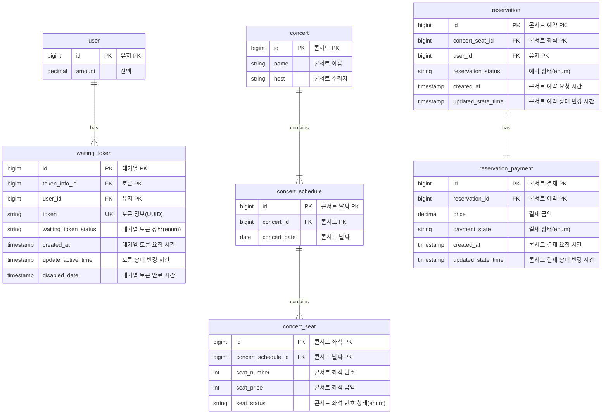
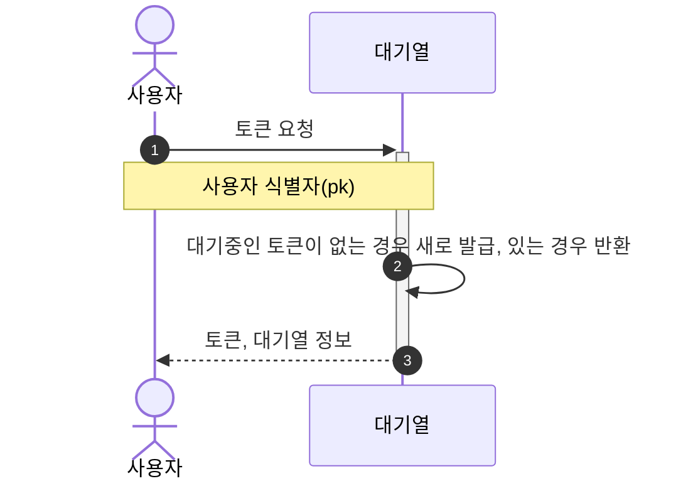
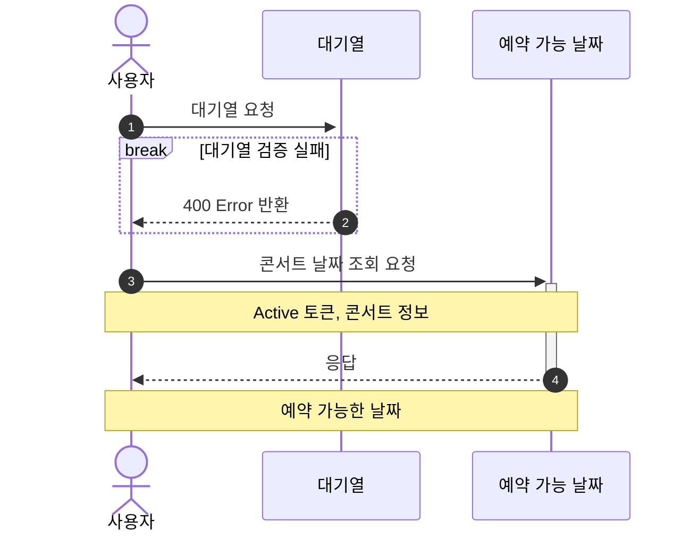
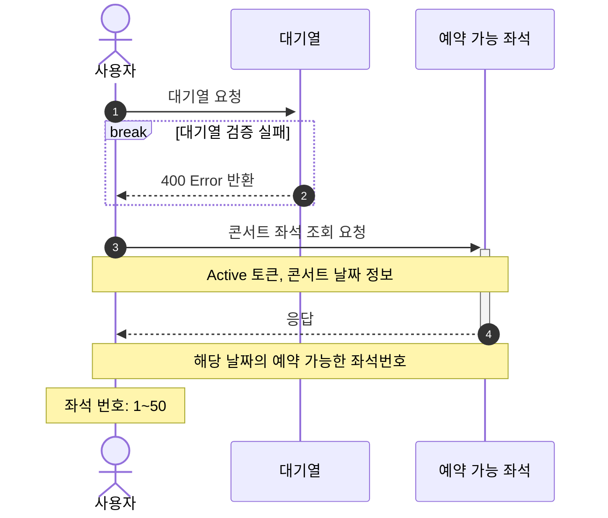
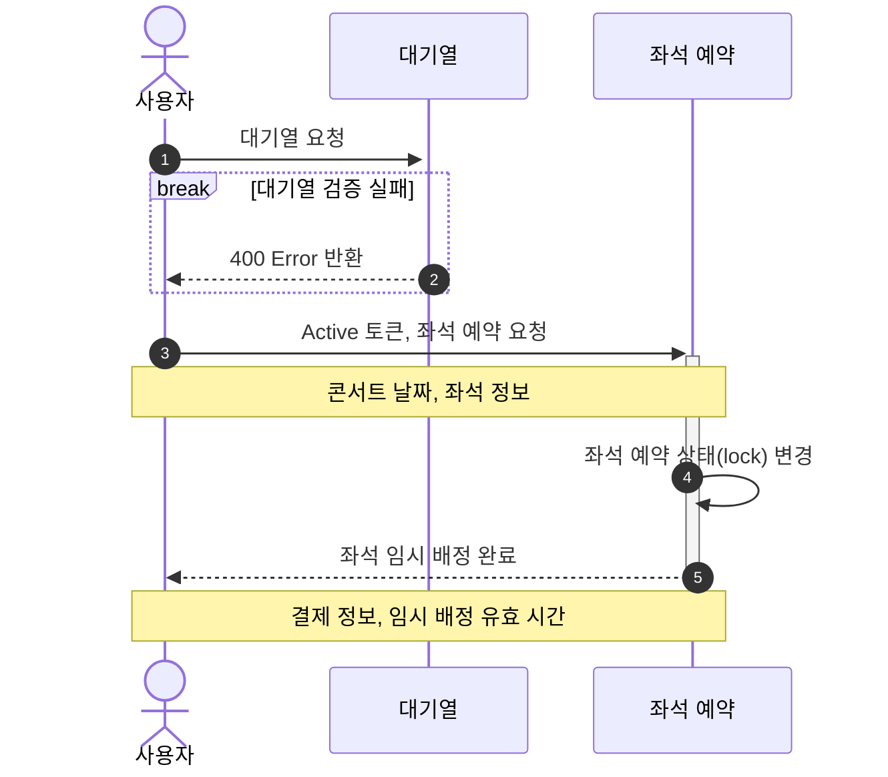
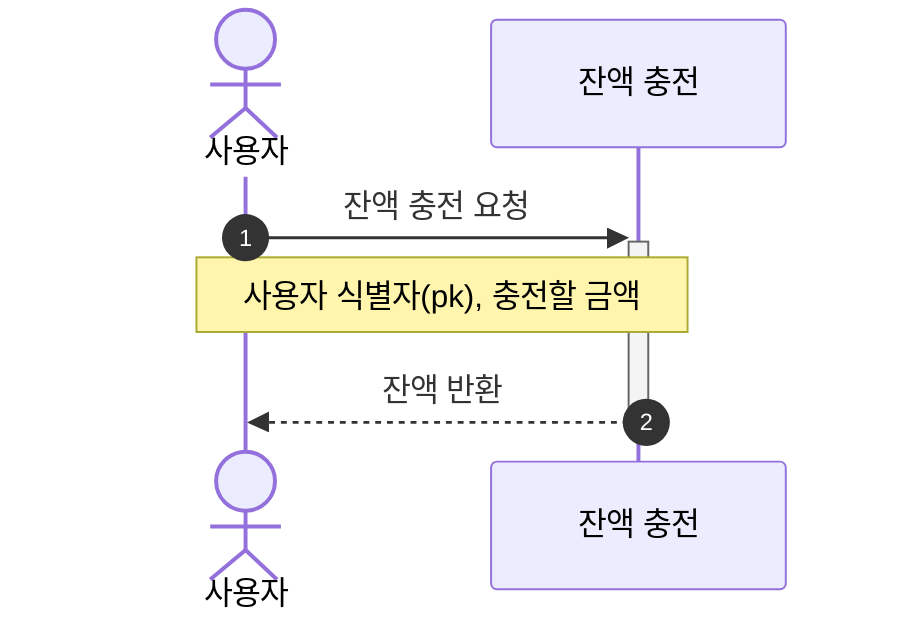
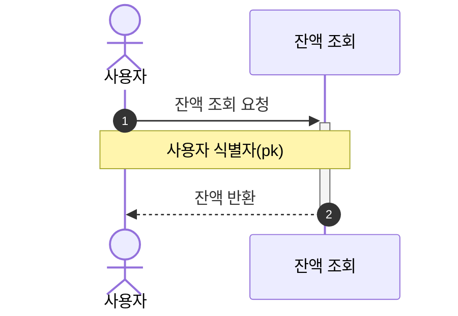
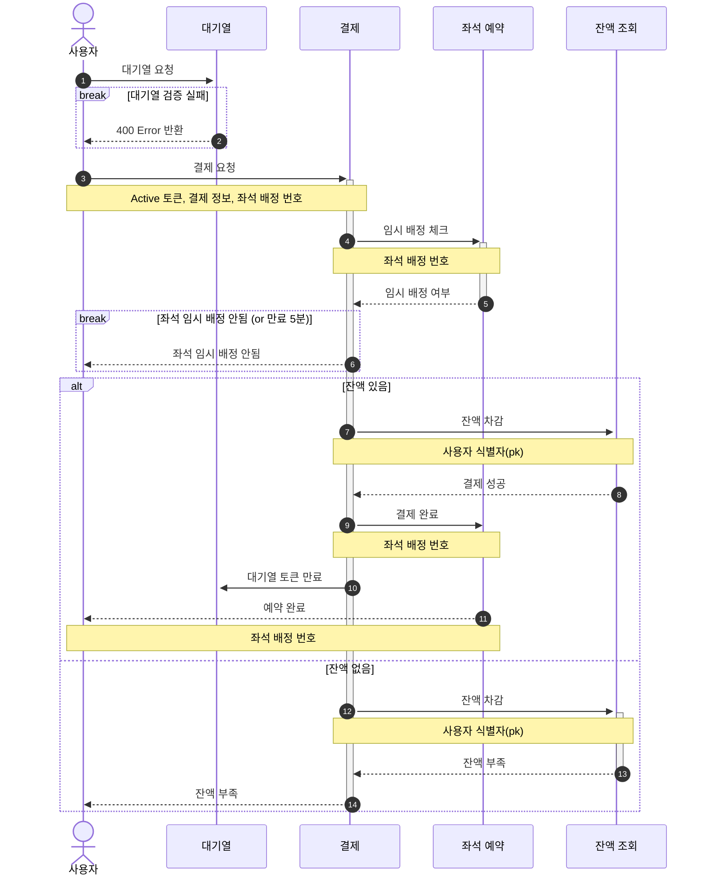

```mermaid
erDiagram
    %% 사용자
    user {
        bigint id PK "유저 PK"
        decimal amount "잔액"
    }

    %% 대기열 토큰 정보
    %% user(1) : waiting_slot(N)
    waiting_token {
        bigint id PK "대기열 PK"
        bigint token_info_id FK "토큰 PK"
        bigint user_id FK "유저 PK"
        
        string token UK "토큰 정보(UUID)"
        %% DEACTIVATE(비활성화), ACTIVATE(활성화), EXPIRED(만료됨)
        string waiting_token_status "대기열 토큰 상태(enum)"
        timestamp created_at "대기열 토큰 요청 시간"
        timestamp update_active_time "토큰 상태 변경 시간"
        timestamp disabled_date "대기열 토큰 만료 시간"
    }

    %% 콘서트
    concert {
        bigint id PK "콘서트 PK"
        string name "콘서트 이름"
        string host "콘서트 주최자"
    }

    %% concert(1) : concert_schedule(N)
    concert_schedule {
        bigint id PK "콘서트 날짜 PK"
        bigint concert_id FK "콘서트 PK"
        date concert_date "콘서트 날짜"
    }

    %% concert_schedule(1) : concert_seat(N)
    concert_seat {
        bigint id PK "콘서트 좌석 PK"
        bigint concert_schedule_id FK "콘서트 날짜 PK"
        int seat_number "콘서트 좌석 번호"
        int seat_price "콘서트 좌석 금액"
        %% AVAILABLE(예약 가능), TEMPORARY(임시 좌석 배정중), RESERVED(예약됨)
        string seat_status "콘서트 좌석 번호 상태(enum)"
    }
    
    %% 예약
    %% user(1) : reservation(N)
    reservation {
        bigint id PK "콘서트 예약 PK"
        bigint concert_seat_id FK "콘서트 좌석 PK"
        bigint user_id FK "유저 PK"
        %% RESERVING(예약중), RESERVED(예약됨), CANCELED(예약 취소)
        string reservation_status "예약 상태(enum)"
        timestamp created_at "콘서트 예약 요청 시간"
        timestamp updated_state_time "콘서트 예약 상태 변경 시간"
    }
    
    %% 결제
    %% reservation(1) : reservation_payment(1)
    reservation_payment {
        bigint id PK "콘서트 결제 PK"
        bigint reservation_id FK "콘서트 예약 PK"
        decimal price "결제 금액"
        %% COMPLETED(결제 완료), CANCELED(결제 취소)
        string payment_state "결제 상태(enum)"
        timestamp created_at "콘서트 결제 요청 시간"
        timestamp updated_state_time "콘서트 결제 상태 변경 시간"
    }

    user ||--|{ waiting_token : has
    concert ||--|{ concert_schedule : contains
    concert_schedule ||--|{ concert_seat : contains
    reservation ||--|| reservation_payment : has
```

## 👤 Sequence Diagram
### 토큰 발급 API

```mermaid
sequenceDiagram
    autonumber
    actor 사용자
    사용자 ->>+ 대기열: 토큰 요청
    Note over 사용자, 대기열: 사용자 식별자(pk)
    대기열 ->> 대기열: 대기중인 토큰이 없는 경우 새로 발급, 있는 경우 반환
    대기열 -->>- 사용자: 토큰, 대기열 정보
```
### 예약 가능 날짜 조회 API

```mermaid
sequenceDiagram
    autonumber
    actor 사용자

    사용자 ->>+ 대기열: 대기열 요청
    break 대기열 검증 실패
      대기열 -->> 사용자: 400 Error 반환
    end
  
    사용자 ->>+ 예약 가능 날짜: 콘서트 날짜 조회 요청
    Note over 사용자, 예약 가능 날짜: Active 토큰, 콘서트 정보
    예약 가능 날짜 -->>- 사용자: 응답
    Note over 사용자, 예약 가능 날짜: 예약 가능한 날짜
```

### 좌석 조회 API

```mermaid
sequenceDiagram
    autonumber
    actor 사용자

    사용자 ->>+ 대기열: 대기열 요청
    break 대기열 검증 실패
        대기열 -->> 사용자: 400 Error 반환
    end
  
    사용자 ->>+ 예약 가능 좌석: 콘서트 좌석 조회 요청
    Note over 사용자, 예약 가능 좌석: Active 토큰, 콘서트 날짜 정보
    예약 가능 좌석 -->>- 사용자: 응답
    Note over 사용자, 예약 가능 좌석: 해당 날짜의 예약 가능한 좌석번호
    Note over 사용자: 좌석 번호: 1~50
```

### 좌석 예약 요청 API

```mermaid
sequenceDiagram
    autonumber
    actor 사용자

    사용자 ->>+ 대기열: 대기열 요청
    break 대기열 검증 실패
      대기열 -->> 사용자: 400 Error 반환
    end
  
    사용자 ->>+ 좌석 예약: Active 토큰, 좌석 예약 요청
    Note over 사용자, 좌석 예약: 콘서트 날짜, 좌석 정보
    좌석 예약 ->> 좌석 예약: 좌석 예약 상태(lock) 변경
    좌석 예약 -->>- 사용자: 좌석 임시 배정 완료
    Note over 사용자, 좌석 예약: 결제 정보, 임시 배정 유효 시간
```

### 잔액 충전 API

```mermaid
sequenceDiagram
    autonumber
    actor 사용자
    
    사용자 ->>+ 잔액 충전: 잔액 충전 요청
    Note over 사용자, 잔액 충전: 사용자 식별자(pk), 충전할 금액
    
    잔액 충전 -->>- 사용자: 잔액 반환
```

### 잔액 조회 API

```mermaid
sequenceDiagram
    autonumber
    actor 사용자
    
    사용자 ->>+ 잔액 조회: 잔액 조회 요청
    Note over 사용자, 잔액 조회: 사용자 식별자(pk)
  
    잔액 조회 -->>- 사용자: 잔액 반환
```

### 결제 API

```mermaid
sequenceDiagram
    autonumber
    actor 사용자

    사용자 ->>+ 대기열: 대기열 요청
    break 대기열 검증 실패
        대기열 -->> 사용자: 400 Error 반환
    end

    사용자 ->>+ 결제: 결제 요청
    Note over 사용자, 결제: Active 토큰, 결제 정보, 좌석 배정 번호
    결제 ->>+ 좌석 예약: 임시 배정 체크
    Note over 결제, 좌석 예약: 좌석 배정 번호
    좌석 예약 -->>- 결제: 임시 배정 여부

    break 좌석 임시 배정 안됨 (or 만료 5분)
        결제 -->> 사용자: 좌석 임시 배정 안됨
    end

    alt 잔액 있음
        결제 ->>+ 잔액 조회: 잔액 차감
        Note over 결제, 잔액 조회: 사용자 식별자(pk)
        잔액 조회 -->> 결제: 결제 성공
        결제 ->> 좌석 예약: 결제 완료
        Note over 결제, 좌석 예약: 좌석 배정 번호
        결제 ->> 대기열: 대기열 토큰 만료
        좌석 예약 -->> 사용자: 예약 완료
        Note over 사용자, 좌석 예약: 좌석 배정 번호
    else 잔액 없음
        결제 ->>+ 잔액 조회: 잔액 차감
        Note over 결제, 잔액 조회: 사용자 식별자(pk)
        잔액 조회 -->>- 결제: 잔액 부족
        결제 -->>- 사용자: 잔액 부족
    end
```