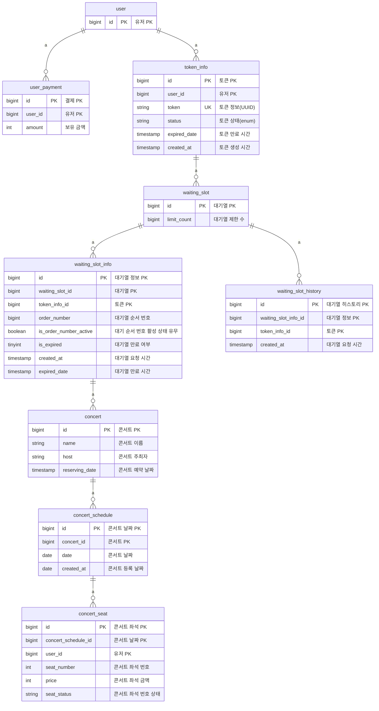

```mermaid
erDiagram
    %% 사용자
    user {
        %% 유저 PK에 대해서 여러 개의 토큰
        bigint id PK "유저 PK"
    }

    %% user(1) : payment(1)
    user_payment {
        bigint id PK "결제 PK"
        bigint user_id "유저 PK"
        int amount "보유 금액"
    }

    %% 토큰 정보
    %% user(1) : token_info(N)
    %% 사용자 -> 대기열 첫 진입 시, 토큰 요청
    token_info {
        bigint id PK "토큰 PK"
        bigint user_id "유저 PK"

        string token UK "토큰 정보(UUID)"
        %% USING(사용중), EXPIRED(만료됨)
        string status "토큰 상태(enum)"
        timestamp expired_date "토큰 만료 시간"
        timestamp created_at "토큰 생성 시간"
    }

    %% 대기열
    waiting_slot {
        bigint id PK "대기열 PK"
        bigint limit_count "대기열 제한 수"
    }

    %% 대기열 정보
    %% waiting_slot(1) : waiting_slot_info(N)
    %% token_info(N) : waiting_slot_info(1)
    %% 사용자 -> 대기열 요청(토큰 있는지 확인)
    waiting_slot_info {
        bigint id PK "대기열 정보 PK"
        bigint waiting_slot_id "대기열 PK"
        bigint token_info_id "토큰 PK"

        bigint order_number "대기열 순서 번호"
        boolean is_order_number_active "대기 순서 번호 활성 상태 유무"
        tinyint is_expired "대기열 만료 여부"
        timestamp created_at "대기열 요청 시간"
        timestamp expired_date "대기열 만료 시간"
    }

    %% 대기열 history log
    %% waiting_slot() : wating_slot_history(1)
    waiting_slot_history {
        bigint id PK "대기열 히스토리 PK"
        bigint waiting_slot_info_id "대기열 정보 PK"
        bigint token_info_id "토큰 PK"
        timestamp created_at "대기열 요청 시간"
    }

    %% 콘서트
    concert {
        bigint id PK "콘서트 PK"
        string name "콘서트 이름"
        string host "콘서트 주최자"
        timestamp reserving_date "콘서트 예약 날짜"
    }

    %% concert(1) : concdert_schedule(N)
    concert_schedule {
        bigint id PK "콘서트 날짜 PK"
        bigint concert_id "콘서트 PK"
        date date "콘서트 날짜"
        date created_at "콘서트 등록 날짜"
    }

    %% concert_schedule(1) : concert_seat(N)
    %% user(1) : concert_seat(N)
    concert_seat {
        bigint id PK "콘서트 좌석 PK"
        bigint concert_schedule_id "콘서트 날짜 PK"
        bigint user_id "유저 PK"
        int seat_number "콘서트 좌석 번호"
        int price "콘서트 좌석 금액"
        %% NONE, PENDING(보류중), RESERVED(예약됨)
        string seat_status "콘서트 좌석 번호 상태"
    }

    user ||--o{ user_payment : a
    user ||--o{ token_info : a
    token_info ||--o{ waiting_slot : a
    waiting_slot_info ||--o{ concert : a
    waiting_slot ||--o{ waiting_slot_info : a
    waiting_slot ||--o{ waiting_slot_history : a
    concert ||--o{ concert_schedule : a
    concert_schedule ||--o{ concert_seat : a
```