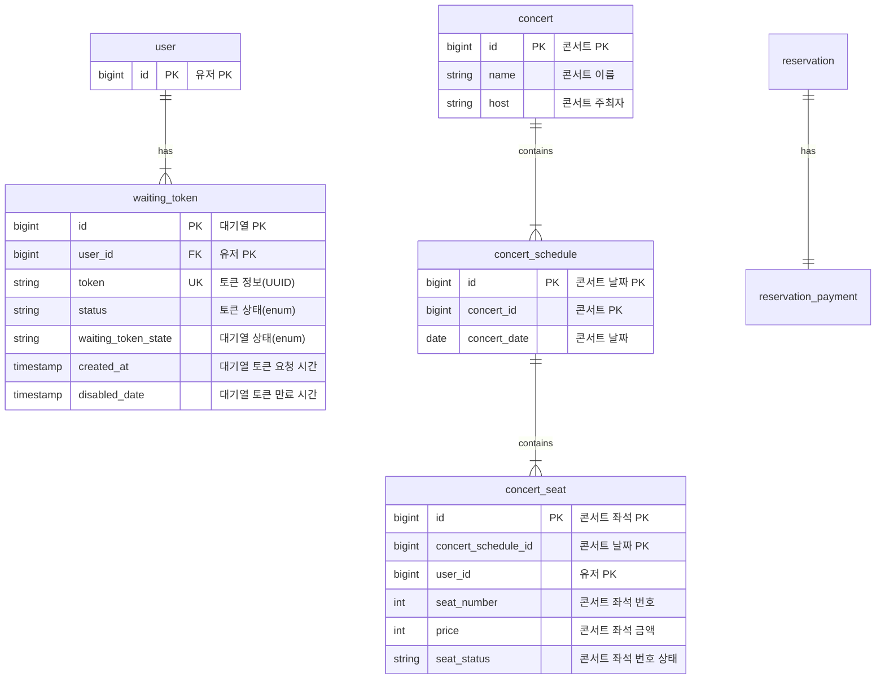

```mermaid
erDiagram
    %% 사용자
    user {
        bigint id PK "유저 PK"
    }

    %% 대기열 토큰 정보
    %% user(1) : waiting_slot(N)
    waiting_token {
        bigint id PK "대기열 PK"
        bigint user_id FK "유저 PK"
        
        string token UK "토큰 정보(UUID)"
        %% ACTIVE(활성화), DISABLED(비활성화)
        string status "토큰 상태(enum)"
        
        %% WAITING(미진입, 대기중), AVAILABLE(토큰 만료 시간 측정)
        string waiting_token_state "대기열 상태(enum)"
        timestamp created_at "대기열 토큰 요청 시간"
        timestamp disabled_date "대기열 토큰 만료 시간"
    }

    %% 콘서트
    concert {
        bigint id PK "콘서트 PK"
        string name "콘서트 이름"
        string host "콘서트 주최자"
    }

    %% concert(1) : concert_schedule(N)
    concert_schedule {
        bigint id PK "콘서트 날짜 PK"
        bigint concert_id "콘서트 PK"
        date concert_date "콘서트 날짜"
    }

    %% concert_schedule(1) : concert_seat(N)
    concert_seat {
        bigint id PK "콘서트 좌석 PK"
        bigint concert_schedule_id "콘서트 날짜 PK"
        bigint user_id "유저 PK"
        int seat_number "콘서트 좌석 번호"
        int price "콘서트 좌석 금액"
        %% NONE, PENDING(보류중), RESERVED(예약됨)
        string seat_status "콘서트 좌석 번호 상태"
    }

    user ||--|{ waiting_token : has
    concert ||--|{ concert_schedule : contains
    concert_schedule ||--|{ concert_seat : contains
    reservation ||--|| reservation_payment : has
```