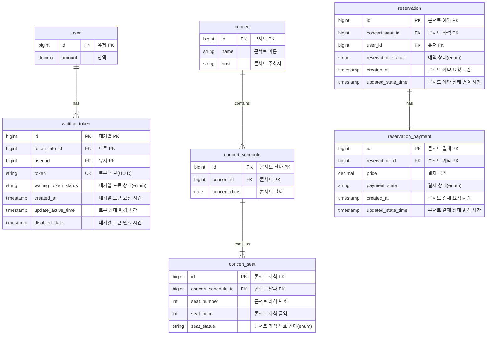

```mermaid
erDiagram
    %% 사용자
    user {
        bigint id PK "유저 PK"
        decimal amount "잔액"
    }

    %% 대기열 토큰 정보
    %% user(1) : waiting_slot(N)
    waiting_token {
        bigint id PK "대기열 PK"
        bigint token_info_id FK "토큰 PK"
        bigint user_id FK "유저 PK"
        
        string token UK "토큰 정보(UUID)"
        %% DEACTIVATE(비활성화), ACTIVATE(활성화), EXPIRED(만료됨)
        string waiting_token_status "대기열 토큰 상태(enum)"
        timestamp created_at "대기열 토큰 요청 시간"
        timestamp update_active_time "토큰 상태 변경 시간"
        timestamp disabled_date "대기열 토큰 만료 시간"
    }

    %% 콘서트
    concert {
        bigint id PK "콘서트 PK"
        string name "콘서트 이름"
        string host "콘서트 주최자"
    }

    %% concert(1) : concert_schedule(N)
    concert_schedule {
        bigint id PK "콘서트 날짜 PK"
        bigint concert_id FK "콘서트 PK"
        date concert_date "콘서트 날짜"
    }

    %% concert_schedule(1) : concert_seat(N)
    concert_seat {
        bigint id PK "콘서트 좌석 PK"
        bigint concert_schedule_id FK "콘서트 날짜 PK"
        int seat_number "콘서트 좌석 번호"
        int seat_price "콘서트 좌석 금액"
        %% AVAILABLE(예약 가능), TEMPORARY(임시 좌석 배정중), RESERVED(예약됨)
        string seat_status "콘서트 좌석 번호 상태(enum)"
    }
    
    %% 예약
    %% user(1) : reservation(N)
    reservation {
        bigint id PK "콘서트 예약 PK"
        bigint concert_seat_id FK "콘서트 좌석 PK"
        bigint user_id FK "유저 PK"
        %% RESERVING(예약중), RESERVED(예약됨), CANCELED(예약 취소)
        string reservation_status "예약 상태(enum)"
        timestamp created_at "콘서트 예약 요청 시간"
        timestamp updated_state_time "콘서트 예약 상태 변경 시간"
    }
    
    %% 결제
    %% reservation(1) : reservation_payment(1)
    reservation_payment {
        bigint id PK "콘서트 결제 PK"
        bigint reservation_id FK "콘서트 예약 PK"
        decimal price "결제 금액"
        %% COMPLETED(결제 완료), CANCELED(결제 취소)
        string payment_state "결제 상태(enum)"
        timestamp created_at "콘서트 결제 요청 시간"
        timestamp updated_state_time "콘서트 결제 상태 변경 시간"
    }

    user ||--|{ waiting_token : has
    concert ||--|{ concert_schedule : contains
    concert_schedule ||--|{ concert_seat : contains
    reservation ||--|| reservation_payment : has
```