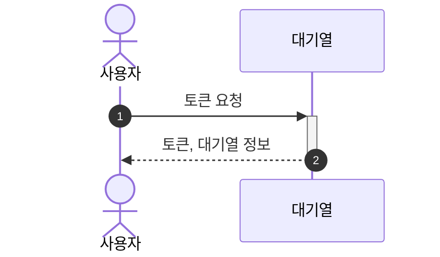
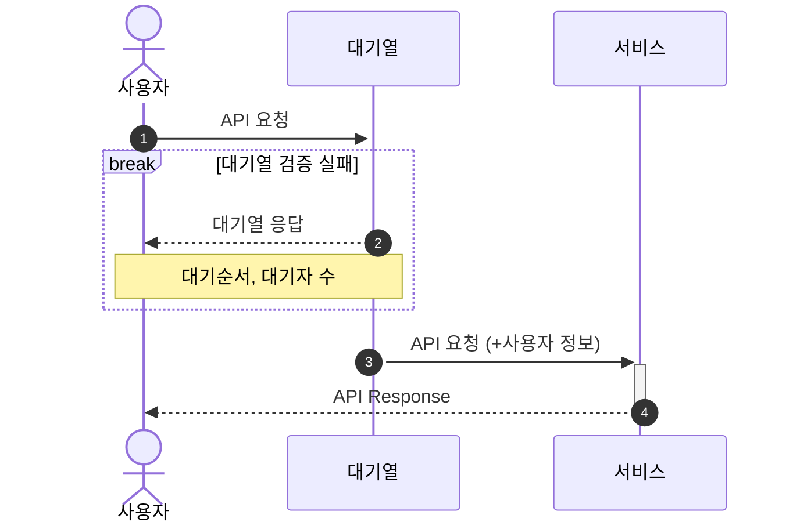
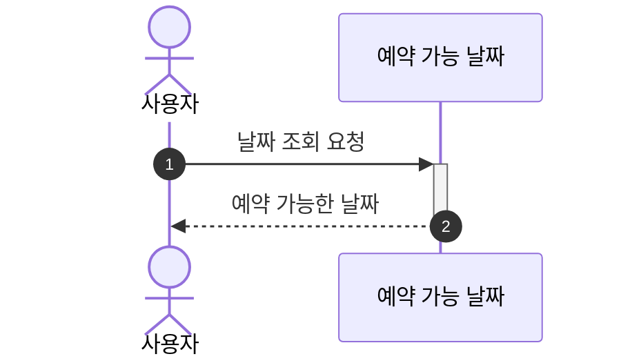
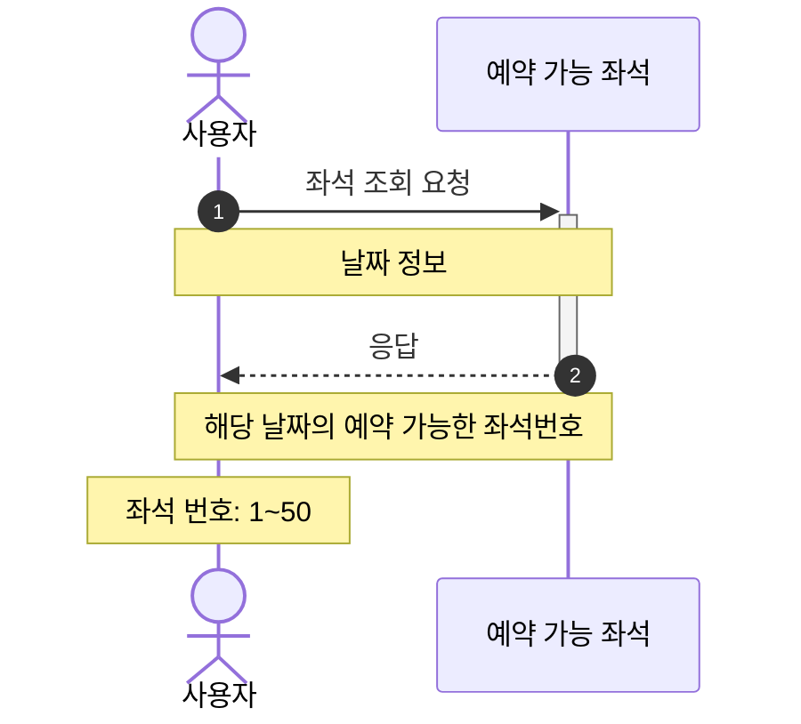
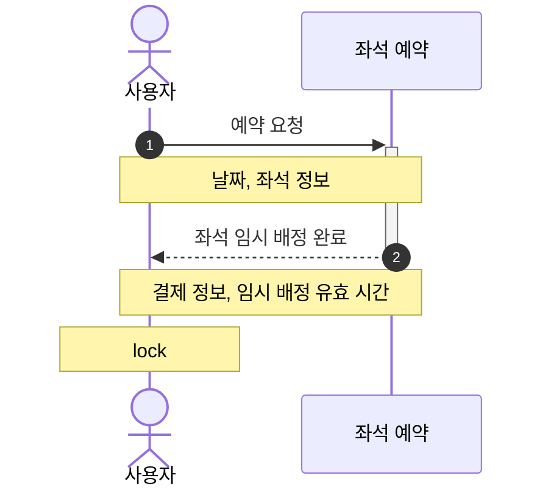
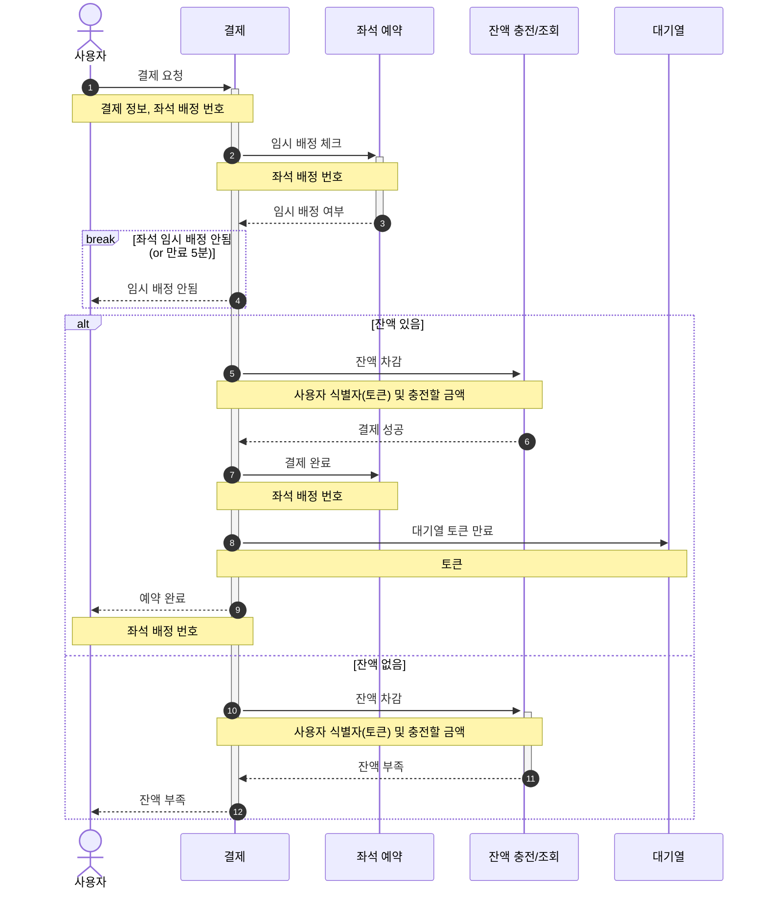

### 토큰 발급 API

```mermaid
sequenceDiagram
    autonumber
    actor 사용자
    사용자 ->>+ 대기열: 토큰 요청
    대기열 -->>- 사용자: 토큰, 대기열 정보
```
### 대기열 검증
> 아래 모든 API는 해당 검증을 통과한 후 진행된다.

```mermaid
sequenceDiagram
    autonumber
    actor 사용자
    사용자 ->>+ 대기열: API 요청
    break 대기열 검증 실패
        대기열 -->> 사용자: 대기열 응답
        Note over 사용자, 대기열: 대기순서, 대기자 수
    end
    대기열 ->>+ 서비스: API 요청 (+사용자 정보)
    서비스 -->>- 사용자: API Response
```
### 날짜 조회 API

```mermaid
sequenceDiagram
    autonumber
    actor 사용자
    사용자 ->>+ 예약 가능 날짜: 날짜 조회 요청
    예약 가능 날짜 -->>- 사용자: 예약 가능한 날짜
```

### 좌석 조회 API

```mermaid
sequenceDiagram
    autonumber
    actor 사용자
    사용자 ->>+ 예약 가능 좌석: 좌석 조회 요청
    Note over 사용자, 예약 가능 좌석: 날짜 정보
    예약 가능 좌석 -->>- 사용자: 응답
    Note over 사용자, 예약 가능 좌석: 해당 날짜의 예약 가능한 좌석번호
    Note over 사용자: 좌석 번호: 1~50
```

### 좌석 예약 API

```mermaid
sequenceDiagram
    autonumber
    actor 사용자
    사용자 ->>+ 좌석 예약: 예약 요청
    Note over 사용자, 좌석 예약: 날짜, 좌석 정보
    좌석 예약 -->>- 사용자: 좌석 임시 배정 완료
    Note over 사용자, 좌석 예약: 결제 정보, 임시 배정 유효 시간
    Note over 사용자: lock
```

### 결제, 잔액 충전/조회 API

```mermaid
sequenceDiagram
    autonumber
    actor 사용자
    사용자 ->>+ 결제: 결제 요청
    Note over 사용자, 결제: 결제 정보, 좌석 배정 번호
    결제 ->>+ 좌석 예약: 임시 배정 체크
  Note over 결제, 좌석 예약: 좌석 배정 번호
    좌석 예약 -->>- 결제: 임시 배정 여부
    break 좌석 임시 배정 안됨 (or 만료 5분)
        결제 -->> 사용자: 임시 배정 안됨
    end
    alt 잔액 있음
        결제 ->>+ 잔액 충전/조회: 잔액 차감
        Note over 결제, 잔액 충전/조회: 사용자 식별자(토큰) 및 충전할 금액
        잔액 충전/조회 -->> 결제: 결제 성공
        결제 ->> 좌석 예약: 결제 완료
        Note over 결제, 좌석 예약: 좌석 배정 번호
        결제 ->> 대기열: 대기열 토큰 만료
        Note over 결제, 대기열: 토큰
        결제 -->> 사용자: 예약 완료
        Note over 사용자, 결제: 좌석 배정 번호
    else 잔액 없음
        결제 ->>+ 잔액 충전/조회: 잔액 차감
        Note over 결제, 잔액 충전/조회: 사용자 식별자(토큰) 및 충전할 금액
        잔액 충전/조회 -->>- 결제: 잔액 부족
        결제 -->>- 사용자: 잔액 부족
    end
```