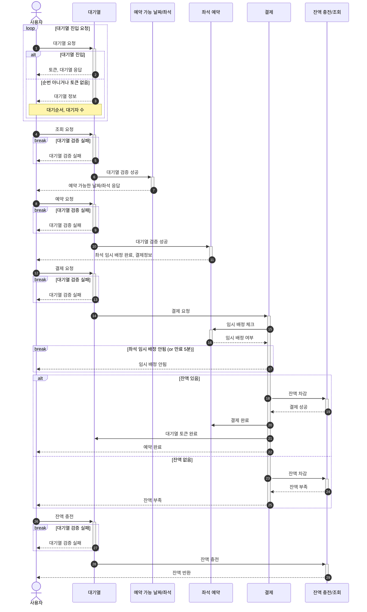

```mermaid
sequenceDiagram
    autonumber
    actor 사용자
    loop 대기열 진입 요청
        사용자 ->>+ 대기열: 대기열 요청
        alt 대기열 진입
            대기열 -->> 사용자: 토큰, 대기열 응답
        else 순번 아니거나 토큰 없음
            대기열 -->>- 사용자: 대기열 정보
            Note over 사용자, 대기열: 대기순서, 대기자 수
        end
    end
    사용자 ->>+ 대기열: 조회 요청
    break 대기열 검증 실패
        대기열 -->>- 사용자: 대기열 검증 실패
    end
    대기열 ->>+ 예약 가능 날짜/좌석: 대기열 검증 성공
    예약 가능 날짜/좌석 -->>- 사용자: 예약 가능한 날짜/좌석 응답
    사용자 ->>+ 대기열: 예약 요청
    break 대기열 검증 실패
        대기열 -->>- 사용자: 대기열 검증 실패
    end
    대기열 ->>+ 좌석 예약: 대기열 검증 성공
    좌석 예약 -->>- 사용자: 좌석 임시 배정 완료, 결제정보

    사용자 ->>+ 대기열: 결제 요청
    break 대기열 검증 실패
        대기열 -->>- 사용자: 대기열 검증 실패
    end
    대기열 ->>+ 결제: 결제 요청
    
    결제 ->>+ 좌석 예약: 임시 배정 체크
    좌석 예약 -->>- 결제: 임시 배정 여부
    break 좌석 임시 배정 안됨 (or 만료 5분)
        결제 -->> 사용자: 임시 배정 안됨
    end
    alt 잔액 있음
        결제 ->>+ 잔액 충전/조회: 잔액 차감
        잔액 충전/조회 -->>- 결제: 결제 성공
        결제 ->> 좌석 예약: 결제 완료
        결제 ->> 대기열: 대기열 토큰 완료
        결제 -->> 사용자: 예약 완료
    else 잔액 없음
        결제 ->>+ 잔액 충전/조회: 잔액 차감
        잔액 충전/조회 -->>- 결제: 잔액 부족
        결제 -->>- 사용자: 잔액 부족
    end
    사용자 ->>+ 대기열: 잔액 충전
    break 대기열 검증 실패
        대기열 -->>- 사용자: 대기열 검증 실패
    end
    대기열 ->>+ 잔액 충전/조회: 잔액 충전
    잔액 충전/조회 -->>- 사용자: 잔액 반환
```
